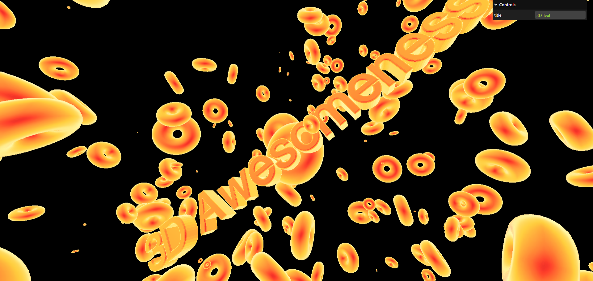

# 3d-text
Three.js Journey Lesson 12 3D text project.

## Description
3D text generated using FontLoader class in THREE.js.

Torus geometry created and randomly placed in the scene, using the lesson tutorial and resources provided in starter code.

BONUS: Animation added.

## Screenshot

## Credits
Bruno Simon at https://threejs-journey.com/
